# DFSha — Arquitectura y evolución

**E6:** [D45–D50 y secuencia de publicación](etapa6-replicacion.md) extienden
la misma SQLite autoritativa con política/revisión, tareas, reservas, historial
de recibos y salud de copias. El ControlNode conserva el papel de namespace y
manifiestos asociado al NameNode; DFSha mantiene implementación propia.
El mantenimiento planifica; los DataNodes transfieren ciphertext por mTLS.
No circula contenido por el control. COM-01/02/04/05 verificadas; COM-03 pendiente E7.

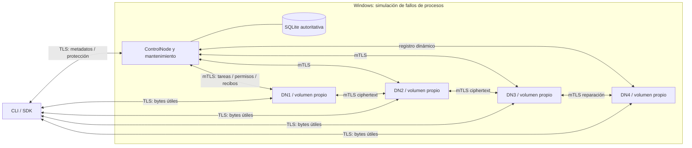

R3/W2 exige copias verificadas en dominios administrativos distintos dentro del
perfil declarado. Con tres DN y R3, cada nodo puede contener todos los bloques;
los primarios y las lecturas se reparten. Si cae uno, quedan dos copias activas:
se mantiene R3 como objetivo y un cuarto permite repararlo sin esperar el retorno.
El regreso puede dejar cuatro copias; no se elimina apresuradamente el excedente.
El control/SQLite, el host y la custodia local de claves siguen siendo puntos de
fallo del laboratorio. No se acredita HA del control ni independencia física.
Los perfiles H1/H2/E5 R1 conservan sus raíces y verificadores originales.

**E5 implementada y verificada en Windows local:** [arquitectura de acceso parcial](etapa5-rf3.md). La misma
SQLite contiene namespace, handles, leases, intenciones y resultados. Queries
autorizan representaciones; BeginRead/Open/BeginWrite y cierres son comandos.
PatchBlock procesa el contenido exclusivamente en DataNodes; el SDK envía el delta.
No se añade etcd, otro control, event sourcing ni una proyección asíncrona.

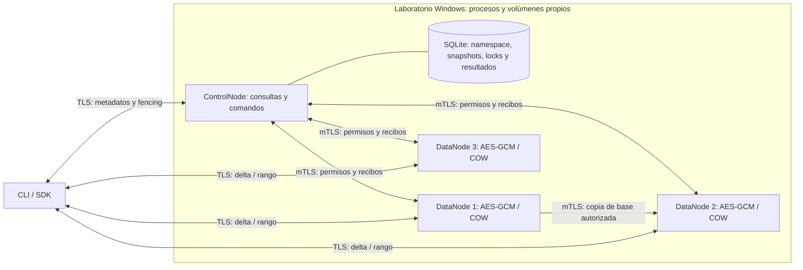

La secuencia de preparación y publicación con fencing transaccional está en
[E5](etapa5-rf3.md). Los componentes dibujados no acreditan HA: comparten host,
hay un solo control y R=1/W=1. La copia S/S es una tarea controlada, no reparación
automática de réplicas.

**E4:** [diseño adoptado](etapa4-diseno.md), [hito ejecutable](hito2.md) y
[protocolo](protocolos-hito2.md) extienden H1. ControlNode/NameNode: namespace,
permisos, manifiestos, ubicaciones y coordinación; DataNodes: almacenamiento de
bloques. Correspondencia conceptual con HDFS, implementación propia DFSha.
R=1/W=1 y una SQLite en el control, sin etcd requerido. Ver estado de pruebas en
[evidencias E4](evidencias/etapa4/README.md).

**Implementación H1 preservada:** [D25–D30](etapa3-diseno.md) y
[contrato operativo](protocolos-hito1.md) sustituyen las propuestas anteriores
incompatibles. Un proceso compone Queries, Commands, SQLiteMetadataStore,
Authorizer, LocalCoordinator, LocalPlacement y EncryptedBlockStore. Consultas y
comandos usan transacciones sobre la misma autoridad; Open(R) es comando/pin.
Puertos ejercidos por H1 en common/ports.py, propuestas futuras bajo Distributed*.

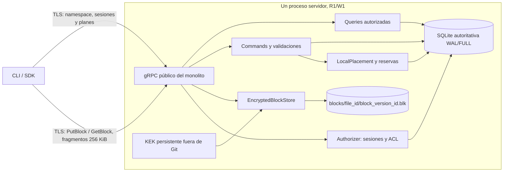

En H1 los bytes pasan por el servidor compartido. Control corresponde al papel de
NameNode de HDFS; bloques al de DataNodes, con lógica propia DFSha. E4 separará
control/almacenamiento y cliente transferirá directamente a DN. Objetivo final
R3/W2 y tres CN/tres etcd permanece. Tres DN con R3 pueden poseer todos los bloques;
distribución se demostrará por colocación y tráfico útil, no por prohibirlo.
Selección futura considera salud/frescura/ocupación/reservas/trabajo/domino de fallo,
round robin entre candidatos comparables y primarios rotados; nunca hash módulo
número de nodos para reconstruir ubicaciones. Q02 continúa pendiente.

El resto documenta arquitectura final y propuestas E1/E2; no acredita relaciones
distribuidas implementadas por este monolito.

Diseño 1.1 · actualizado 2026-09-08 · Opción 1 C/S con composición S/S. **E2 aporta contratos y diagnóstico ejecutable; negocio/distribución/despliegue pendientes.** Reglas en [especificacion.md](especificacion.md), decisiones en [decisiones.md](decisiones.md), contratos concretos en [protocolos.md](protocolos.md). Diagramas finales siguen siendo diseño, no procesos desplegados.

## 1. Evolución que conserva los hitos

| Versión prevista | Procesos y estado | Cierre y límite explícito |
| --- | --- | --- |
| Hito 1, semana 8, etapas 2–3 | CLI/SDK separado; un servidor Python modular; SQLite y bloques cifrados locales persistentes. | RF1/RF2 completos por red, autenticación/TLS básicos, streaming y publicación atómica. Un host es punto único de fallo; no acredita HA. |
| Hito 2, semana 10, etapa 4 | Un ControlNode y al menos tres DataNodes; registro dinámico; bytes cliente–DataNode y replicación S/S. | Distribución real en lectura/escritura y protocolos. Control único todavía sin HA. Se admite perfil temporal explícito R=1/W=1, que no cumple RNF2 final. |
| Hacia hito 3, etapas 5–7 | RF3; R=3/W=2; tres ControlNodes; migración a tres miembros etcd; locks, pins e idempotencia compartidos. | Probar por separado acceso parcial, replicación, quórum, fencing y recuperación. |
| Hito 3, semana 12, etapa 8 | Arquitectura final con seguridad completa, control/metadatos redundantes y flujos de recuperación. | Evidencia de HA, replicación, consistencia y seguridad; no cerrar con funcionalidades solo descritas. |
| Final, semana 13, etapas 9–11 | Distribución en VMs académicas, acceso externo, mediciones y entregables. | Infraestructura diseñada ahora; scripts y aprovisionamiento solo en etapas posteriores. |

### Componentes y despliegue inicial

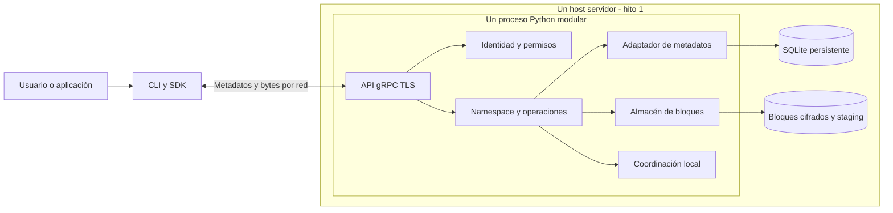

En este hito los bytes sí atraviesan el único servidor: es el monolito exigido. La separación de módulos no se presenta como distribución. La CLI no monta el volumen del servidor. El monolito confirma primero archivos de bloques durables y después la transacción SQLite; una caída intermedia deja objetos huérfanos recuperables, no nombres públicos incompletos. La atomicidad local se apoya en [SQLite](https://sqlite.org/atomiccommit.html), con transacciones y configuración durable comprobada en el filesystem elegido.

Interfaces previstas: `MetadataStore`, `Coordinator`, `BlockStore`, `Authorizer` y transporte. Inicialmente se llaman dentro de un proceso; después se sustituyen por adaptadores de red/etcd sin cambiar la semántica pública. Antes de migrar se preservarán la versión del hito, backup e inventario; se validarán conteos, IDs, ACL, manifiestos y hashes tras la migración. Ninguna base SQLite individual seguirá siendo autoridad de metadatos en la versión final.

## 2. Componentes finales, responsabilidades y estado

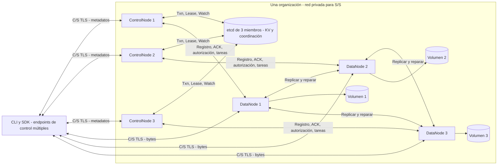

Las aristas CN–DN ilustran las relaciones; cualquier ControlNode puede atender a cualquier DataNode autorizado. No hay afinidad obligatoria entre los roles que compartan VM. El flujo de contenido no pasa por ControlNodes ni etcd.

| Componente | Responsabilidad | Estado y recuperación |
| --- | --- | --- |
| CLI/SDK | Contexto cwd, contratos, streaming, reconstrucción, reintentos acotados, descubrimiento y cambio de réplica. | Sesión/handles y cachés limitadas de manifiestos; endpoints de entrada configurables. Caché de ubicación se invalida ante error/revisión. Ninguna tabla estática archivo→nodo. |
| ControlNode | Namespace, ACL, planificación, apertura/pins, locks, transacciones, validación de ACK, ubicación y tareas. | Sin autoridad durable propia; datos de operaciones, usuarios, handles y tareas en etcd. Cachés no autorizan commits. Puede atender cualquier instancia. |
| DataNode | `PutBlock/GetBlock/PatchBlock`, validación y cifrado, ACK durable, replicación, inventarios y espacio. | Volumen propio: objetos inmutables, headers, staging cifrado, recibos persistentes e inventario local reconstruible. Registro de arranque con generación de nodo. |
| etcd | KV consistente, transacciones, leases, revisiones y Watch. | Tres miembros y volúmenes independientes; árbol, manifiestos, ACL, sesiones, operaciones, locks y referencias. No almacena bytes de archivos. |
| Coordinación | Exclusión por recurso y tareas; fencing de propietarios vencidos. | Autoridad final etcd; un líder con lease para mantenimiento, múltiples ControlNodes activos para servicio. |
| Identidad/autorización | Autenticación de usuarios, permisos de recurso y roles de nodos. | Usuarios/grupos/ACL y hashes de sesiones/permisos en etcd; certificados y claves privadas fuera de Git y etcd sin cifrar. |

La separación de control y bloques toma como referencia la [arquitectura HDFS](https://hadoop.apache.org/docs/stable/hadoop-project-dist/hadoop-hdfs/HdfsDesign.html). La modificación aleatoria, los locks y los snapshots aquí definidos son diseño de DFSha; no se atribuyen a HDFS ni se reemplaza el proyecto por instalarlo.

## 3. Modelo persistente y límites de metadatos

| Entidad | Campos esenciales propuestos |
| --- | --- |
| Usuario/grupo/ACL | IDs estables, hash Argon2id, miembros, permisos, propietario y revisión de autorización. |
| Directorio/entrada | `directory_id`, padre, nombre, ACL, hijos por clave, contador y revisión de hijos. |
| Archivo | `file_id`, padre/nombre, ACL, `content_epoch`, `deleted`, raíz actual, tamaño, versión y revisión CAS. |
| Manifiesto | Páginas inmutables: índice lógico, `block_version_id`, longitud y SHA-256; raíz/indexación paginada. |
| Réplica/nodo | Ubicaciones reales por bloque, `node_id`, dominio de fallo, generación de arranque, endpoints C/S/S/S, estado, espacio y recibo durable. |
| Operación | Usuario, `request_id`, digest de intención, estado, base/delta, política R/W, recibos, resultado y pins de staging. |
| Handle/lock | Sesión, archivo/época, snapshot, modo, revisión; scope, propietario, lease y generación de fencing. |
| Mantenimiento | Trabajo, propietario/generación, estado, fuentes/destinos e IDs de objetos retirados. |

El manifiesto identifica contenido, no fija servidores. Un mapa aparte de réplicas permite reparar o trasladar un bloque sin cambiar la versión lógica del archivo. Ni un hash recalculado sobre una membresía nueva ni la IP conocida ayer sustituyen ese mapa autoritativo.

etcd está diseñado para registros pequeños: documenta límite predeterminado de solicitud de **1,5 MiB** y cuota de backend de **2 GiB**; el tamaño de backend y la compactación deben supervisarse. La configuración documenta **128 operaciones por transacción** por defecto. [Límites](https://etcd.io/docs/v3.6/dev-guide/limit/), [configuración](https://etcd.io/docs/v3.6/op-guide/configuration/).

DIS: páginas de manifiesto de hasta 64 entradas y máximo serializado de 64 KiB, índices jerárquicos también acotados y listados de hasta 100 entradas por página. Si una entrada es mayor, se reduce la cantidad por página. Uploads grandes preparan páginas en lotes; nunca publican un manifiesto ilimitado en una clave o transacción. Una raíz pequeña referencia las páginas ya persistidas y selladas. Cambios parciales reutilizan páginas inmutables no afectadas. Una llamada `write` de 16 MiB afecta a lo sumo cinco bloques; la transacción final compara un conjunto acotado de locks, versiones/época, handle, autorización y raíz. E2 comprueba presupuestos de mensajes Protobuf de página/commit; el conteo del Txn definitivo queda PENDIENTE E7, cuando exista ese adaptador, sin inventar una transacción implementada ahora.

Las versiones retenidas por handles son claves explícitas de DFSha; compactar revisiones MVCC no las elimina. Los registros compactos de resultado/idempotencia y tombstones de identidad se conservan durante la vida del proyecto. La presión de cuota produce rechazo controlado y mantenimiento, no eliminación de historial que permita repetir una operación antigua como nueva. Ampliar esta retención para producción queda fuera del alcance académico.

## 4. Transporte y cinco relaciones de comunicación

| Alternativa | Ventajas para DFSha | Coste o límite |
| --- | --- | --- |
| REST sobre HTTP con API documentada | Herramientas de inspección comunes; recursos, códigos HTTP y transferencia de cuerpos/streams. Puede cumplir el PDF. | Habría que definir OpenAPI, mensajes de locks/commit, streaming y SDK coherentes. REST no impide binarios ni impone JSON. |
| gRPC y Protocol Buffers — elegida DIS | IDL tipada, stubs Python, RPC unary y streams de cliente/servidor, deadlines y credenciales. Un contrato sirve a CLI, SDK y S/S. | Toolchain generador/runtime debe ser compatible; requiere diagnóstico gRPC y soporte HTTP/2 real en red. No garantiza rendimiento ni consistencia por sí solo. |

Se elige gRPC por el contrato común y transferencia fragmentada; no se presupone superioridad medida frente a REST. Referencias: [semántica HTTP](https://www.rfc-editor.org/rfc/rfc9110.html), [gRPC Python](https://grpc.io/docs/languages/python/basics/). E2 concreta los nombres/servicios, mensajes, límites y stubs en [protocolos.md](protocolos.md); la tabla siguiente resume relaciones del diseño.

| ID / relación exigida (PDF, p. 5) | Operaciones y dirección propuestas | Datos, seguridad y fallos |
| --- | --- | --- |
| COM-01 Cliente–ControlNode | C→CN: Login/Logout, List/Stat/Mkdir/Rmdir/Remove, BeginUpload, SealManifest, CommitUpload/AbortUpload, Open/Close, BeginWrite/CommitWrite, Lock/Unlock/Renew, ResolveBlocks, GetOperation. | Metadatos por gRPC TLS y sesión de usuario. Paginación; sin bytes del archivo. Fallos: permisos, conflicto, resultado incierto o quórum; el SDK puede cambiar de CN. |
| COM-02 Cliente–DataNode | C→DN: PutBlock y PatchBlock con stream de fragmentos; GetBlock devuelve stream del rango autorizado. | C/S TLS, sesión y permiso opaco limitado. DN consulta AuthorizeBlock en CN. Rechazo por permiso, offset, integridad, espacio o timeout; resolver otra réplica antes de reintentar. |
| COM-03 ControlNode–ControlNode | CN1→etcd→CN2/CN3: Txn/Range para estado, Lease/Lock para exclusión y Watch para notificación; tareas y operaciones compartidas. | Relación **mediada**, sin RPC directa entre CN en la propuesta. etcd cliente y peers usan mTLS/RBAC. Watch solo optimiza notificaciones; se relee KV consistente antes de decidir. Sin quórum se rechaza operación. Consulta Q05 pendiente. |
| COM-04 ControlNode–DataNode | DN→CN: RegisterNode, Heartbeat, BlockReport, ReportDurable, AuthorizeBlock/AuthorizeInternal. CN→DN: VerifyReceipt, ReplicateBlock, DeleteRetiredBlock, Health. | S/S privado, mTLS y rol de nodo. ACK con identidad, generación, op, bloque, longitud y checksum; tareas idempotentes y con fencing. No circula contenido de archivo por CN. |
| COM-05 DataNode–DataNode | DN→DN: StoreReplica/GetReplica para réplica/reparación y obtención de base de PatchBlock. | S/S privado con mTLS; permiso limitado a tarea, bloque, fuente/destino y generación. Verificación de header, AEAD, checksum y persistencia en destino; copia completa cifrada por fragmentos. |

Cada nodo expone API documentada: CLI mediante SDK público; CN y DN mediante servicios gRPC propios; etcd mediante API v3 administrativa interna. Exponer API no exige hacer pública su interfaz administrativa.

### Mediación del control y consenso

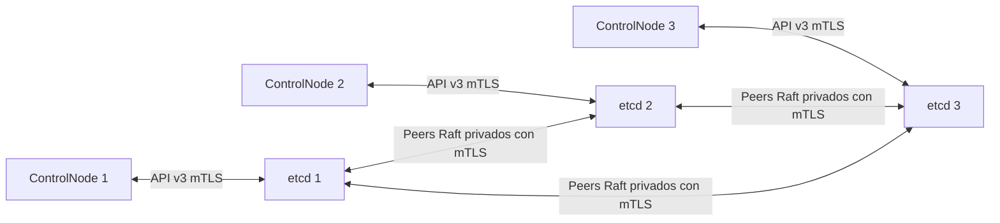

Cada CN conoce los tres endpoints etcd y puede conectarse a cualquiera; las líneas muestran ejemplos. La autoridad es un único clúster etcd con mayoría **2 de 3**, no tres bases que eligen valores por su cuenta. La replicación Raft la proporciona etcd. DFSha no implementa consenso. Las garantías KV y las limitaciones de Watch fundamentan esta decisión: [garantías de API](https://etcd.io/docs/v3.6/learning/api_guarantees/).

Deadlines DIS iniciales concretados en E2: metadatos 5 s, autorización interna/heartbeat 3 s, RPC de bloque 15 s, Lock hasta 6 s y sellado 15 s; operación de archivo hasta 30 min configurable con progreso. Upload/handle/locks se renuevan mientras haya actividad autorizada. Streams cancelados no se publican automáticamente. Reintentos con backoff/jitter, máximo tres por RPC dentro del plazo total; conflictos no se reintentan cambiando intención. Respuesta perdida requiere consultar ledger. [Plazos por RPC](protocolos.md), [deadlines gRPC](https://grpc.io/docs/guides/deadlines/), [reintentos](https://grpc.io/docs/guides/retry/).

## 5. Particionamiento, colocación y memoria

Parámetros DIS: bloque lógico **4 MiB**, fragmento de transporte **256 KiB**, paralelismo inicial **4** y colas acotadas con backpressure. Para tamaño `L>0`, hay `ceil(L/B)` bloques; el último contiene los bytes restantes. `L=0` produce manifiesto vacío. El fragmento no es una unidad independiente de replicación ni de commit.

El control selecciona dominios distintos con espacio reservado y nodos sanos, atendiendo capacidad y carga; rota el nodo primario entre índices de bloque. Registra el plan y las ubicaciones confirmadas reales. El cliente envía bloques diferentes a primarios diferentes y elige réplicas de lectura repartidas, con paralelismo acotado. Tener R=3 no demuestra por sí mismo reparto del tráfico útil: la prueba medirá explícitamente bytes C→DN y DN→C en al menos dos nodos.

Un primario recibe un bloque o parche, construye una versión inmutable y lo replica a otros nodos. Un DN procesa un bloque cifrado completo de tamaño acotado para validar AEAD; no devuelve plaintext sin autenticar. Un parche solo necesita la base del bloque afectado y el delta. Memoria esperada proporcional a `paralelismo × (bloque + buffers de cifrado + fragmentos)`, no al tamaño del archivo. Los límites de tareas por proceso deben incluir múltiples clientes; cuatro tareas por cliente sin límite global no acotan la RAM del servidor.

Las reservas por upload evitan sobreasignación optimista de disco; un cambio de capacidad puede hacer fallar la escritura y exige abortar/replanificar. Nodos nuevos se registran con dos endpoints diferenciados: C/S alcanzable por el cliente e interno S/S. `localhost`, DNS exclusivos de Docker y direcciones privadas inalcanzables desde Internet no se anuncian como destinos públicos.

## 6. Durabilidad y publicación atómica

### Protocolo de datos y de commit

Objetivo final **R=3** copias de cada versión de bloque; publicación con al menos **W=2** confirmaciones durables de nodos en dominios distintos. W cuenta datos; la mayoría 2/3 de etcd cuenta metadatos. Son condiciones independientes: ninguna sustituye autorización, validación de versiones ni publicación atómica.

1. **PREPARING:** el control registra `request_id`, digest de intención, usuario, archivo/época y base, locks, reserva/pins y política. Cada objeto nuevo tiene identidad que nunca se reutiliza para otro contenido.
2. El cliente transmite directamente a los DataNodes elegidos. `PatchBlock` obtiene una base autorizada local o por S/S, aplica el delta y produce un bloque nuevo. `PutBlock` recibe el bloque completo.
3. Cada nodo verifica longitud/checksum, cifra y persiste. ACK durable exige escribir el objeto temporal cifrado, sincronizar archivo, renombrar dentro del mismo filesystem, sincronizar el directorio y conservar header/recibo durables. Se comprobarán esas garantías en Linux y el volumen real. Al reiniciar puede reconstruir recibos desde objetos completos; temporales incompletos no cuentan.
4. El primario replica; **cada destino** acredita su propia copia. El control recibe por mTLS o consulta `VerifyReceipt`; no acepta el conteo declarado por el cliente o un ACK reenviado sin autenticar. Repetir objeto/op/digest devuelve el mismo recibo; mismo ID con otros bytes se rechaza.
5. El control verifica W para todos los bloques nuevos. Las páginas de manifiesto se preparan, validan y sellan por lotes: índices completos, longitudes, orden, checksums y recibos de fuentes autorizadas. El sello de la operación solo se emite al completar todas sus páginas. Los recibos históricos de bloques reutilizados preservan su durabilidad ya confirmada; se comprueba además una réplica accesible de cada bloque requerido. Si hay degradación se registra y repara, sin exigir retransmitir todo el archivo en cada parche. Una comprobación de disponibilidad no garantiza que el nodo no falle inmediatamente después.
6. **COMMIT:** el control construye raíz candidata desde la versión vigente y ejecuta Txn/CAS comparando raíz/época/archivo vivo, estado de operación, lease/propietario de cada lock, handle, revisión de autorización y protección de referencias frente a GC. Para crear también compara padre vivo, reserva y ausencia del nombre. Publica raíz+tamaño+versión, entrada nueva cuando aplique, handle y resultado `COMMITTED` atómicamente.
7. Devuelve versión, tamaño, bytes aceptados y estado de replicación. R=2 disponible se informa como degradado; se agenda completar R=3. Fallar la Txn nunca convierte staging en una versión visible.

Las páginas preparadas se fijan mediante el registro de operación y no se borran entre el sellado y el commit. Las copias recibidas deben corresponder a la misma versión/hash; no vale mezclar bloques de uploads distintos. Un ACK prueba persistencia en su momento, no que el nodo jamás falle después. El modelo garantiza conservar datos confirmados frente a **un** fallo independiente mientras W=2 se cumplió; no promete sobrevivir a perder ambas copias antes de completar R=3. La disponibilidad requiere al menos una copia íntegra por bloque solicitado y quórum/autoridad alcanzables.

### Secuencia de escritura final

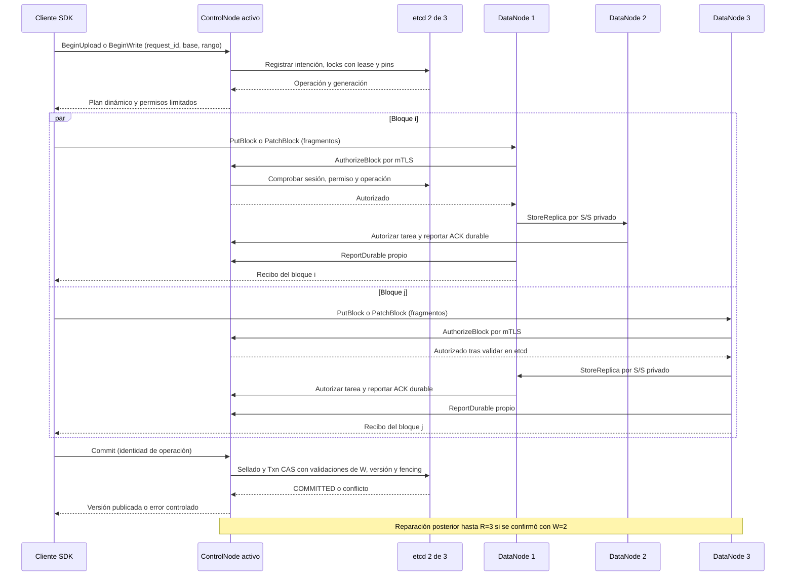

El diagrama abrevia la autorización del destino de réplica y la lectura de base de los parches; ambas siguen COM-04/05. etcd recibe evidencias y metadatos del control, no ejecuta por sí mismo la comprobación de bytes/ACK. En el monolito, esta secuencia se reduce a staging local durable seguido de transacción SQLite con R=1/W=1.

## 7. Lecturas, concurrencia y fencing

### Secuencia de lectura final

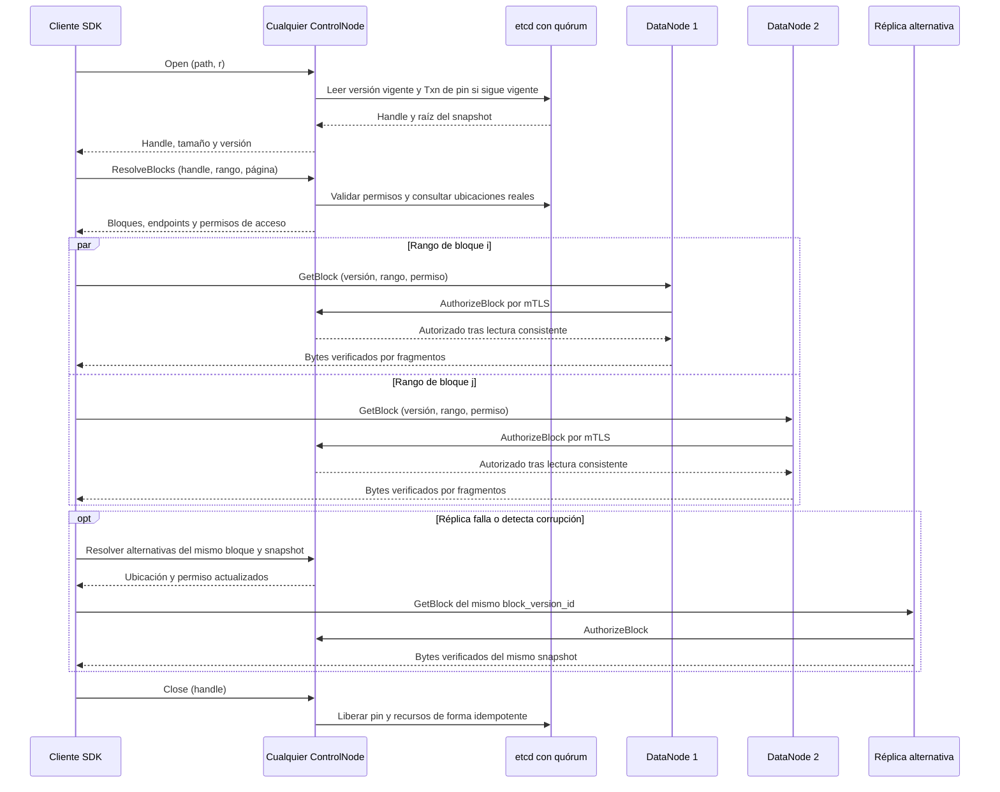

El SDK verifica SHA-256 de cada bloque completo contra el manifiesto obtenido del CN. Al recibir un archivo verifica todos sus bloques, orden/longitud y raíz; calcula además el hash de bytes completo, comparándolo con SnapshotRef.file_sha256 **solo si está presente**. Tras write parcial se elimina ese hash opcional salvo recálculo de todo el archivo; no se conserva un hash antiguo ni se equipara hash del manifiesto con hash de bytes. Para rango pequeño DN valida AEAD/checksum de bloque completo antes de devolverlo; SDK comprueba posición/longitud/identidad y range_sha256 por TLS. Este hash de rango no permite comprobar autónomamente la fracción contra el manifiesto sin descargar el bloque completo. [Contrato de integridad E2](protocolos.md).

### Autoridad de locks

La API de [locks de etcd](https://etcd.io/docs/v3.6/dev-guide/api_concurrency_reference_v3/) aporta una clave ligada a lease que puede compararse en una transacción. El algoritmo de rangos pertenece a DFSha: por archivo se usa un mutex breve de administración de locks obtenido con esa API. Bajo él se comprueban el marcador de lock completo y las claves de los bloques solicitados, y se crean los locks de rango ligados a lease en una Txn que también compara la propiedad del mutex. No se mantiene ese mutex durante la transferencia de bytes.

Un lock completo obtiene el mismo mutex y comprueba por lectura paginada que no hay locks de rango/tamaño activos antes de crear su marcador. Mientras el mutex siga vigente no se admite una adquisición paralela; si vence antes de la Txn, esta falla. Expirar locks puede reducir el conjunto, nunca introducir un nuevo propietario sin pasar por ese mutex. Liberaciones comparan token y dueño. Esta administración evita una carrera entre un lock completo y uno de rango sin serializar los datos de escritores en bloques distintos.

La generación de fencing usa la revisión de creación de la clave de propiedad, más una época del servicio. La Txn de publicación compara que esa misma propiedad aún existe y conserva su generación; comprobarla antes de transferir no basta. El control revalida versiones afectadas y aplica deltas sobre la raíz vigente, como [especificación, §6](especificacion.md#s6). El registro de operación/handle impide dos mutaciones simultáneas con el mismo handle a través de distintos ControlNodes.

Un DataNode puede conservar staging enviado por un proceso que perdió su lock después de ser autorizado. Ese objeto es inmutable e invisible: el proceso obsoleto no puede publicarlo. Borrar o sobrescribir objetos ya confirmados no está permitido en la API de usuario.

## 8. Fallos, reparación, borrado y recuperación

Detección DIS: heartbeat cada 3 s; sospecha inicial tras 12 s sin actividad y comprobación activa antes de nuevas asignaciones. Un timeout indica sospecha, no prueba de muerte. Los heartbeats no eligen autoridades de metadatos; etcd mantiene esa función. Se conservan ubicaciones de copias no disponibles para reconciliar su retorno, pero no se usan como fuentes sanas sin validación.

| Condición | Comportamiento previsto |
| --- | --- |
| Un DN cae con R=3 | Leer otra copia; nuevas escrituras si hay W=2 destinos con capacidad. Registrar bloques subreplicados. |
| Tres DN, uno caído | Quedan como máximo dos copias en nodos vivos. Recuperar tres requiere que vuelva o añadir otro DN/dominio; no contar dos procesos del mismo host como solución. |
| Menos de W destinos durables para un bloque nuevo | No publicar; `INSUFFICIENT_REPLICAS`. Preservar raíz anterior y staging con vencimiento. |
| Falta disco | Excluir destinos/reservar otros; si no alcanza, `NO_SPACE`. Nunca rebajar W automáticamente. |
| No hay copia íntegra de un bloque solicitado | `DATA_UNAVAILABLE` o `DATA_LOSS` según evidencia; no sustituir por una versión vieja ni por ceros. |
| Un CN cae | SDK cambia a otro; retoma por request_id y ledger compartido. |
| Un miembro etcd cae | Mayoría restante puede servir tras elección si se necesita; documentar interrupción observada. |
| Dos miembros etcd caen/partición sin mayoría | Nuevas operaciones y autorizaciones fallan con deadline; no se ofrecen lecturas actuales de caché ni mutaciones locales. |
| DNS/endpoint inaccesible | Probar otros endpoints independientes ya configurados; no depender de un balanceador único. |
| Claves no disponibles al iniciar DN | Nodo no está listo; no cuenta como réplica legible. |

La reparación la coordina un CN con lease de mantenimiento; sus tareas persistidas y acotadas pueden retomarse por otro. Selecciona una copia íntegra referenciada por una versión viva/pin, replica por S/S a otro dominio, verifica durabilidad, y actualiza el mapa de réplicas. `BlockReport` contrasta inventario tras reinicio: ningún reporte resucita una entrada borrada o decide la versión actual del archivo. Corrupción detectada retira la copia de las fuentes elegibles y programa reparación.

**Recolección segura:** los objetos provisionales se fijan desde el registro de operación antes de usarse; manifiestos actuales, snapshots, uploads y reparaciones fijan sus objetos. Inicialmente la GC se ejecutará de forma explícita y coordinada. Para decidir objetos retirables adquiere una barrera distribuida de referencias: nuevas aperturas, preparaciones y commits deben comprobar esa barrera en la transacción que crea referencias. Durante el recorrido consistente se posponen estas operaciones con plazo finito; las lecturas ya fijadas pueden continuar. Se marca `RETIRED` únicamente aquello que se demuestre sin referencias. Si la barrera expira o no se puede probar esa ausencia, se abandona la eliminación.

`RETIRED` es irreversible y la identidad de bloque no se reutiliza. Tras liberar la barrera, ningún plan nuevo puede referenciarlo. El borrado físico comprueba por API interna el estado retirado, identidad exacta y generación de tarea/propietario; un comando viejo no puede eliminar una réplica que vuelva a formar parte de una versión publicada. El coste/pausa de GC se medirá; no se presenta como disponibilidad continua durante mantenimiento. Se prefiere retener basura a borrar un bloque cuya seguridad no esté probada.

**Backup:** replicación no protege frente a borrado administrativo o desastre de toda la organización. Se diseñan backups coordinados: pausar publicaciones/GC, obtener snapshot etcd, fijar y copiar todos los bloques alcanzables de esa revisión, guardar inventario/hashes y recuperar el juego de claves asociado desde custodia independiente. Validar una restauración en entorno aislado. La recuperación después de pérdida total usa una época de servicio nueva, revoca sesiones/handles/tokens viejos y contempla el incremento de revisiones recomendado por [etcd](https://etcd.io/docs/v3.6/op-guide/recovery/). RPO/RTO de desastre se medirán y dependen del último backup; no equivalen a la tolerancia a un host perdido.

## 9. Seguridad y disponibilidad de claves

Modelo de amenazas acotado: cliente sin autenticar, usuario que intenta acceder a recursos ajenos, nodo no incorporado, interceptación, manipulación de bloques y robo de disco/backup. Se asume que un servidor legítimo con privilegios y claves no está completamente comprometido; no se promete resistencia bizantina ni protección de plaintext en memoria frente a root.

TLS C/S verifica CA y nombre/SAN del servidor. mTLS S/S verifica identidad única y rol en CN–DN, DN–DN, CN–etcd y peers etcd; la red privada no reemplaza el cifrado. Se separan listeners de usuario e internos y se limita quién registra nodos, replica, administra o retira objetos. Se habilitan explícitamente autenticación y RBAC de etcd. [Credenciales gRPC](https://grpc.io/docs/guides/auth/), [seguridad etcd](https://etcd.io/docs/v3.6/op-guide/security/).

La sesión de usuario y el permiso de bloque serán valores opacos aleatorios de 256 bits generados por la biblioteca estándar; el control guarda su hash y restricciones. El permiso de bloque expira inicialmente a los 60 s y está ligado a usuario/sesión, operación, file_id, versión, rango y DN destino. El DN presenta permiso y sesión al CN por mTLS al iniciar cada stream, que se limita a 4 MiB/15 s. El CN consulta el estado consistente; no se añade un servicio único de autorización. Permisos y sesiones nunca se imprimen en logs. Contraseñas mediante [argon2-cffi/Argon2id](https://argon2-cffi.readthedocs.io/en/stable/argon2.html), con límites de intentos/concurrencia y parámetros que se comprobarán en las VMs.

Los bloques se cifran con **AES-256-GCM** mediante `cryptography`. Cada nueva versión/intentona de cifrado genera una DEK nueva y un nonce de 96 bits; se usa una sola vez esa combinación. Un reintento reenvía exactamente el objeto ya cifrado, o genera DEK nueva; nunca vuelve a cifrar datos distintos con la misma pareja clave/nonce. Datos autenticados incluyen file_id, block_version_id, longitud y versión del formato. DEK se envuelve con una KEK mediante AES Key Wrap de biblioteca; el header conserva `key_id`, DEK envuelta, nonce, longitud, checksum y tag. [AEAD](https://cryptography.io/en/stable/hazmat/primitives/aead/), [envoltura de claves](https://cryptography.io/en/stable/hazmat/primitives/keywrap/).

Las réplicas copian el objeto cifrado y pueden descifrar porque cada DN autorizado tiene el anillo KEK necesario. Se mantiene fuera de su volumen de datos, de imágenes y de Git, con permisos del sistema y provisión administrativa cifrada. Hay copia de recuperación cifrada fuera de las VMs y al menos dos custodios del equipo; nombres y soporte real pendientes. No se implementa un servidor de claves único. Para este proyecto la provisión del anillo al iniciar es más simple que operar un KMS propio; un KMS del proveedor solo se adoptaría tras verificar permisos y disponibilidad académica.

Rotar KEK exige distribuir la nueva, mantener las anteriores mientras existan bloques/backups que las necesiten y reenvolver claves mediante nuevas envolturas verificadas, sin sobrescribir a ciegas un header usado por otra réplica. No se retiran claves hasta verificar todos los objetos y backups afectados. Certificados tienen claves privadas distintas por nodo; CA de emisión fuera de los nodos y respaldo cifrado. La pérdida de la CA no detiene sesiones con certificados válidos, pero sí requiere recuperación antes de renovar o incorporar nodos.

etcd, SQLite, WAL, temporales, snapshots y backups requieren volumen o archivo cifrado además de TLS. Docker no cifra un volumen por declararlo persistente. En cloud se configurará y comprobará el cifrado de discos/snapshots según [EBS](https://docs.aws.amazon.com/ebs/latest/userguide/ebs-encryption.html) o [Compute Engine](https://docs.cloud.google.com/compute/docs/disks/disk-encryption). En desarrollo se deberá verificar el cifrado del volumen anfitrión o preparar un volumen Linux cifrado. No se almacena plaintext temporal en discos sin esa protección.

## 10. Despliegue final y puntos únicos de fallo

Modalidad DIS elegida: cliente externo por **endpoints C/S públicos con TLS**, uno por CN y DN, y listeners S/S exclusivamente por direcciones privadas en VPC. No se usa VPN ni proxy único en el camino de datos. Firewall restringe el acceso público a los orígenes de prueba autorizados; una API interna no se publica porque la VM tenga dirección pública. Puertos propuestos, aún sin configurar:

| Origen → destino | Puerto TCP propuesto | Exposición y protección |
| --- | --- | --- |
| Cliente externo → CN | 7443 | C/S, TLS y sesión. |
| Cliente externo → DN | 7444 | C/S, TLS, sesión y permiso por bloque. |
| CN/DN → CN | 7445 | Solo VPC, mTLS, roles y autorización interna. |
| CN/DN → DN | 7446 | Solo VPC, mTLS, replicación/administración limitada. |
| CN → etcd | 2379 | Solo VPC y CN/administración autorizada, mTLS/RBAC. |
| etcd → etcd | 2380 | Solo tres miembros por red privada, mTLS. |
| Administrador → VM | 22 si se usa SSH | Solo origen administrativo autorizado, claves. |

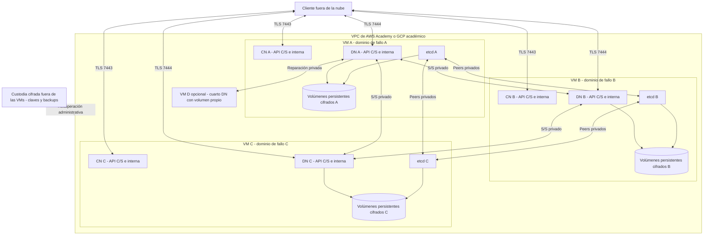

El diagrama no representa recursos existentes. Las comunicaciones privadas CN–etcd y CN–DN son las del diagrama de componentes; se omiten aquí para legibilidad. Cada VM aloja tres procesos/contenedores con límites de CPU/RAM y volúmenes separados para datos y etcd. Colocalizar correlaciona la caída de un CN, DN y miembro etcd y compite por recursos. La colocación deja dos miembros etcd y dos DN tras perder una VM. Se solicitarán zonas/dominios independientes si la cuenta lo permite; VMs distintas en una zona prueban caída de VM, no de zona ni independencia física garantizada.

| Posible punto único de fallo | Solución diseñada y límite de evidencia |
| --- | --- |
| ControlNode único | Tres instancias activas con todo el estado compartido. |
| Base de metadatos/disco único | Tres miembros etcd con volúmenes independientes; mayoría y backup separado. |
| Única copia de bloque/host | R=3/W=2 en dominios distintos; verificar ubicación real. |
| Entrada/balanceador/VPN único | SDK con tres entradas C/S de control directas y reintento por endpoint. Sin gateway central obligatorio. |
| Resolución DNS única | Endpoints independientes; alternativa de bootstrap por IP válida incluida en SAN y configuración confiable, si falla DNS. La tabla de entrada no contiene ubicaciones de archivos. |
| Autenticación o ledger local | Estado de usuarios, sesiones, permisos y operaciones en etcd, atendido por cualquier CN. |
| Líder de mantenimiento | Lease con fencing y trabajos persistidos; reparación puede pausarse mientras cambia líder. |
| Clave solo en DN caído | Anillo disponible en DN supervivientes y custodia cifrada fuera de VMs; prueba de reemplazo. |
| CA o backup único | Respaldo cifrado y custodios independientes; verificar restauración y expiración. |
| Una región/cuenta académica/cliente sin conectividad | Riesgo residual compartido; no se promete multirregión ni tolerancia a cierre de cuenta o corte total de Internet. |

## 11. Preparación académica sin aprovisionamiento

Se necesita completar: proveedor/cuenta y responsables; región y zonas permitidas; créditos y duración de sesión; límites IAM, VM, IP, disco y red; ruta pública al cliente y privada entre servidores; certificados/SAN; DNS o IP de bootstrap; permisos para cifrado y recuperación de snapshots; persistencia después de apagar el laboratorio; mecanismo de renovación de credenciales y apagado seguro.

Dimensionamiento DIS de partida: tres VMs Linux de 2 vCPU y 4 GiB RAM cada una, disco de datos de 20 GiB por VM más sistema/etcd, y capacidad temporal para un cuarto DN. Es una solicitud de capacidad por verificar, no un recurso creado ni un costo cotizado. Con 1 GiB lógico y tres réplicas se necesitan unos 3 GiB de datos base; reservar adicional para snapshots, staging, pruebas concurrentes y reparación. etcd y cifrado no deben quedarse sin RAM por asignarla toda a buffers.

Una [VPC AWS](https://docs.aws.amazon.com/vpc/latest/userguide/what-is-amazon-vpc.html) o [VPC GCP](https://docs.cloud.google.com/vpc/docs/vpc) da la red de servicio; permisos/beneficios de una cuenta académica concreta no se deducen de esas capacidades generales. Docker Compose se ejecutará por host con inventario explícito; un Compose local no distribuye automáticamente contenedores en VMs. Los [volúmenes Docker](https://docs.docker.com/engine/storage/volumes/) deben sobrevivir al contenedor, y su política de borrado/backup se documentará.

En etapa 9 se producirán inventario real, reglas de firewall, configuración por VM, scripts de inicio/parada y recuperación, y pruebas desde un cliente externo. Se documentarán IPs reales solo cuando existan, sin secretos. Una prueba local o un diagrama no acredita Internet. El estado actual de cuentas, herramientas y verificaciones está en [estado.md](estado.md).
# Evolución aprobada para etapa 3

El diseño actualizado previo a implementar está en [D25–D29](etapa3-diseno.md).
Prevalece sobre tamaños, plazos y propuestas anteriores incompatibles de este documento.
CQRS comparte SQLite autoritativa; control y bloques comparten proceso en hito 1.
## Despliegue y secuencias E4

H1 mantiene el proceso modular único. E4 reutiliza `Queries`/`Commands` y
`SQLiteMetadataStore`, añadiendo `DistributedControl` para planificación,
autorización interna y recibos; `NoContentStore` impide leer contenido desde
control. `DataNode` tiene inventario propio, coordinador acotado y el cifrador
H1. El SDK sigue usando los contratos RF1/RF2, con endpoints de cada plan.

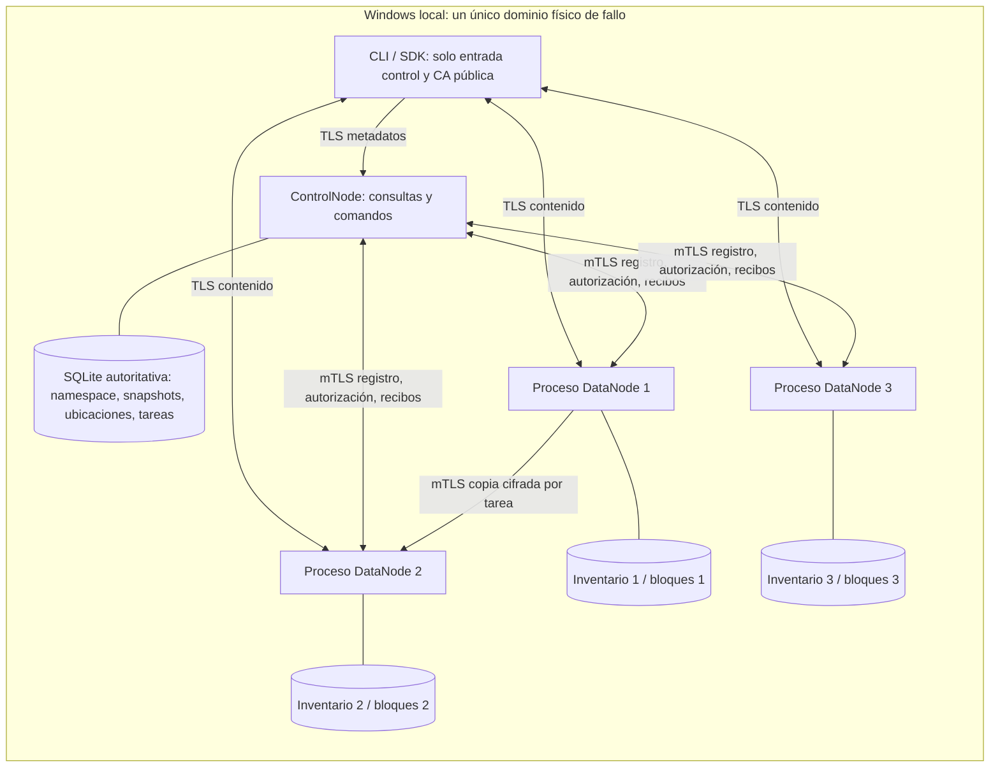

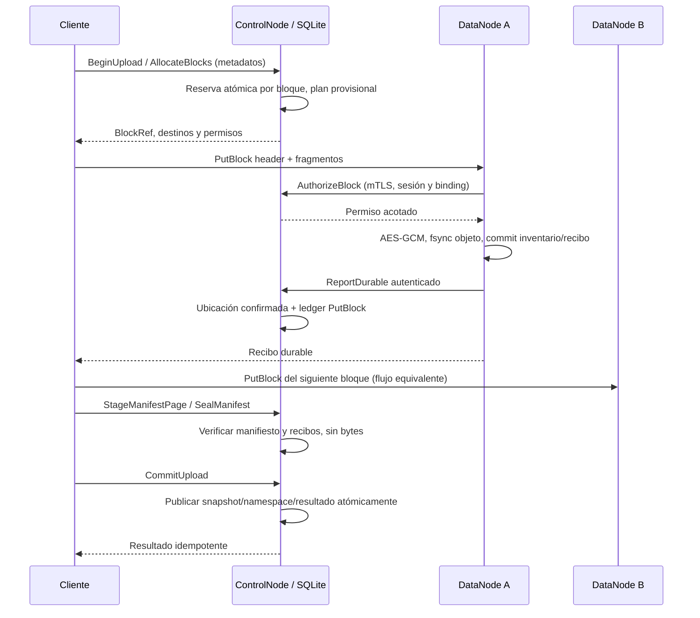

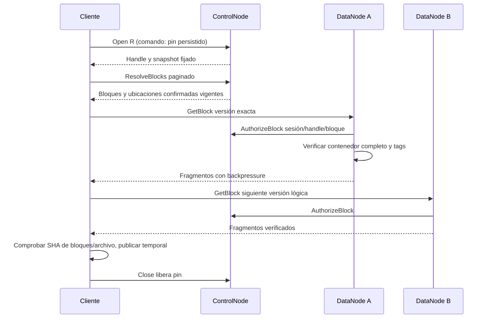

La relación ControlNode–ControlNode **no se implementa aquí**. El diseño final
conserva tres ControlNodes y tres miembros etcd como mediación de coordinación
y metadatos por mayoría. R=3/W=2 final es una política de datos independiente;
con tres DataNodes y R=3 cada nodo puede contener todos los bloques. E4 demuestra
distribución por tráfico útil de varios nodos, sin imponer esa política aún.
