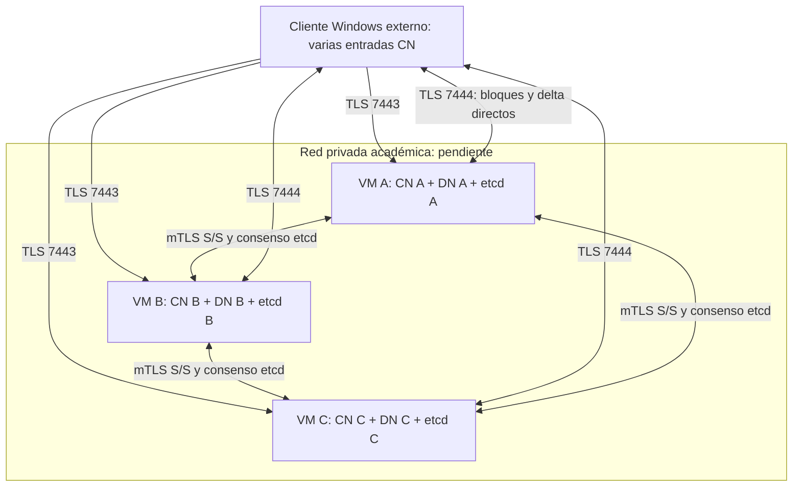

# E9 — despliegue académico reproducible

**Estado: PARCIAL; validación cloud BLOQUEADA POR ENTORNO.** No hay proveedor
académico, cuenta/proyecto, región ni presupuesto verificados. No se crearon VMs,
discos, direcciones públicas ni snapshots. Los artefactos locales no acreditan
acceso Internet, tolerancia a pérdida de host ni E9 completa. No se ejecuta E10.

## Propuesta concreta para autorizar el laboratorio

Proveedor efectivo: **pendiente**. Si está disponible AWS Academy, propuesta:
us-east-1, tres VMs Ubuntu 24.04 amd64 con imagen fijada por ID antes de crear,
`t3.medium` (2 vCPU/4 GiB), una por zona permitida. Si solo permite una zona,
mantener tres VMs y limitar la afirmación a caída de VM. Región y zonas deben
coincidir con permisos y cuota del laboratorio. No usar cuenta personal.

Por VM: raíz cifrada 30 GiB y disco persistente cifrado 40 GiB montado en
`/var/lib/dfsha`; cuota de bloques 20 GiB deja margen para etcd, staging, snapshots
y reparaciones. Tres IP públicas estables o DNS estable con actualización y SAN
verificados; acceso SSH desde IP administrativa /32. Sin NAT Gateway ni balanceador.
Etcd y S/S enlazan IP privadas. Reservar 768 MiB CN, 1024 MiB DN, 768 MiB etcd
como límites, más 1,5 GiB aproximados para SO/cache/administración en la VM de 4 GiB;
los límites son techos, no reservas simultáneas garantizadas. Medir consumo total.

Ventana propuesta: ocho horas, apagar las VMs al terminar, conservar discos y
backup hasta revisión explícita. Propuesta de tope **USD 5**, sujeto a confirmación
de precios/región y saldo. No es un permiso ya concedido ni un límite automático
de facturación. La cuarta VM no está incluida ni se creará sin capacidad autorizada.

Referencia consultada 2026-10-01: la [tabla oficial T3](https://aws.amazon.com/ec2/instance-types/t3/)
publica USD 0,0418/h para t3.medium Linux en Virginia: tres durante ocho horas,
USD 1,0032. Usar modo Standard para evitar créditos Unlimited adicionales; puede
limitar CPU al agotarse créditos. [IPv4 público](https://aws.amazon.com/vpc/pricing/):
USD 0,005/IP/h, también retenidas sin uso; tres durante 24 h, USD 0,36.
Con tarifa **condicional** gp3 de USD 0,08/GB-mes del
[ejemplo oficial EBS](https://aws.amazon.com/ebs/pricing/), 210 GiB por 24 h en mes
de 30 días son USD 0,56. Base orientativa **USD 1,9232**, excluye snapshots,
egreso Internet/interzona, impuestos y cambios regionales. La tarifa EBS efectiva,
cuotas, snapshot/egreso y saldo deben consultarse para la cuenta antes de crear.
Discos retenidos: aproximadamente USD 16,80/mes a esa tarifa; tres IP retenidas,
USD 10,80/mes de 30 días. No afirmar gratuidad por ser académico.

Si el acceso disponible es GCP académico, verificar proyecto, región, cuotas y
precios antes de sustituir esta propuesta. Los listeners y unidades Linux son
independientes del proveedor; la validación administrativa de inventario GCP
sigue pendiente de disponer del proyecto. No se escoge AWS por tener un ejemplo.

## Topología propuesta; no inventario ejecutado



Una VM caída elimina tres roles correlacionados. Quedan mayoría 2/3 etcd, dos
controles y dos DN: W=2 sigue posible, R=3 permanece degradado. No hay votación
de versiones entre DN. CN→etcd→CN coordina estado; Q05 sigue pendiente.

## Preparación disponible

`cloud_preflight.py` solo consulta el proveedor explícito y la cuenta esperada;
no elige el perfil por defecto. No imprime credenciales ni stderr bruto del CLI.
Registra comandos, códigos realmente observados y bloqueos. AWS filtra recursos
por etiqueta `DFShaDeployment`; GCP por etiqueta `dfsha-deployment`.

```powershell
.\.venv-win\Scripts\python.exe scripts/cloud_preflight.py
# Después de habilitar el acceso académico fuera de Git:
.\.venv-win\Scripts\python.exe scripts/cloud_preflight.py --provider aws --profile academic --account <cuenta> --region us-east-1 --deployment-id <uuid> --output .runtime/cloud/preflight.json
.\.venv-win\Scripts\python.exe scripts/cloud_bundle.py --inventory .runtime/cloud/inventory.json --preflight .runtime/cloud/preflight.json --output .runtime/cloud/bundle
```

Copiar `deploy/cloud/inventory.example.json` a `.runtime/cloud/`, completar con
recursos reales y fijar commit/hash del wheel. El ejemplo contiene parámetros
pendientes y debe rechazarse. Sin `--preflight` solo se renderiza una propuesta
UNVERIFIED; no habilita arranque de servicios. El inventario verificado relaciona
VM, IP, disco y dominio a observaciones del API, no a etiquetas inventadas por DN.

Los demás procedimientos, pruebas y limitaciones se completan en esta etapa
según el acceso disponible. El inventario real de recursos permanece vacío.

## Puertos y direcciones

| Flujo | Listener / anuncio | Restricción |
| --- | --- | --- |
| Cliente→CN | `0.0.0.0:7443` / DNS o IP pública:7443 | TLS, CA/SAN y CIDR de clientes |
| Cliente→DN | `0.0.0.0:7444` / DNS o IP pública:7444 | TLS y permiso dinámico de bloque; cliente no configura mapa de DN |
| CN/DN→CN | IP privada:7445 | mTLS, identidades autorizadas, solo tres IP privadas |
| CN/DN→DN | IP privada:7446 | mTLS, tarea/recibo/acción autorizada |
| CN→etcd | IP privada:2379 | mTLS + RBAC del prefijo; root administrativo separado |
| etcd→etcd | IP privada:2380 | mTLS, lista de CN de miembros |
| Administración→VM | 22 | SSH por clave, origen administrativo restringido; verificar host key |

El listener público no intenta enlazar la IP NAT del proveedor. IPv6 no se
habilita en este perfil inicial. Métricas/health etcd permanecen en el listener
privado protegido; no se publica otro puerto. Además del firewall cloud, se
prepara una tabla nftables `inet dfsha`; nunca se vacía el ruleset global.
Aplicarla únicamente en las VMs dedicadas y después de validar el CIDR de SSH.
El estado de conexión existente se conserva, pero probar una segunda sesión
SSH antes de cerrar la primera. No se desactiva TLS para cambiar endpoints.

## Artefacto, instalación y secretos

Se eligió ejecución **nativa con systemd**, sin Compose ni otro orquestador.
No se modifica el stack fijado. `cloud_artifacts.py` construye el wheel y obtiene
etcd/etcdctl/etcdutl Linux 3.6.14 del archivo oficial cuyo hash está fijado.
El informe registra hash, commit base y si había cambios sin commit. Solo usar
para despliegue el artefacto de un commit revisado y árbol limpio.

```powershell
.\.venv-win\Scripts\python.exe scripts/cloud_artifacts.py --output .runtime/cloud/artifacts
.\.venv-win\Scripts\python.exe scripts/cloud_secrets.py --inventory .runtime/cloud/inventory.json --output .runtime/cloud/private
```

La segunda orden pide la contraseña sin eco y prepara una autoridad SQLite
inicial **cifrada**, para importar una sola vez con el procedimiento de E7.
No persiste la contraseña; persiste Argon2id dentro del registro cifrado.
Cada control recibe su clave TLS, la clave de autoridad y la de metadatos;
cada DN recibe su clave TLS, KEK común y clave de inventario propia. Las hojas
incluyen SAN público y privado real, vigencia siete días; la CA administrativa
de 30 días permanece en `custodian/` fuera de las VMs. No se regenera al reiniciar.
Un directorio existente provoca rechazo, no sobreescritura. La raíz privada
debe permanecer fuera de Git y protegida por ACL/custodia; no enviarla completa
a ninguna VM. Copiar únicamente el subdirectorio de su slot por SSH autenticado.

Preparar cada bundle `a/b/c` con `etcd-sha256.json` de los artefactos y transferir
el wheel, los tres binarios y scripts por SSH/SCP con host key previamente verificada.
No usar `StrictHostKeyChecking=no`, user-data con secretos ni argumentos con claves.
Instalar previamente Python 3.12/venv, nftables y herramientas de administración
en la imagen Ubuntu fijada; registrar la versión real del SO/Python.
El instalador exige `/var/lib/dfsha` montado; **no formatea ni monta discos**.

```powershell
foreach ($slot in @('a','b','c')) {
    Copy-Item .runtime/cloud/artifacts/etcd-sha256.json ".runtime/cloud/bundle/$slot/etcd-sha256.json"
}
```

Linux, comandos preparados pero todavía NO EJECUTADOS sobre una VM:

```bash
sudo bash install-host.sh /root/dfsha-staging/a /root/dfsha-staging/dfsha-0.3.0-py3-none-any.whl /root/dfsha-staging/etcd
sudo bash provision-host.sh /root/dfsha-private/a
sudo /opt/dfsha/venv/bin/python /opt/dfsha/admin/cloud_host.py firewall
sudo systemctl start dfsha-etcd
```

Repetir por host con su slot. La provisión compara el deployment/slot y, en AWS,
la identidad de la VM por IMDSv2; no imprime el token de metadatos. Rechaza
inventario o claves existentes: una recuperación no debe pasar por bootstrap.
Instalar solo el material administrativo `admin/` en `/etc/dfsha/admin` de A,
root:root 0700/0600, nunca `custodian/ca.key`. Con los tres miembros etcd listos:

```bash
sudo /opt/dfsha/venv/bin/python /opt/dfsha/admin/cloud_initialize.py --output /etc/dfsha/admin/activation-result.json
# Aplicar la misma época del resultado en cada host:
sudo /opt/dfsha/venv/bin/python /opt/dfsha/admin/cloud_host.py activate --epoch <uuid-del-resultado>
sudo /opt/dfsha/venv/bin/python /opt/dfsha/admin/cloud_host.py start
sudo /opt/dfsha/venv/bin/python /opt/dfsha/admin/cloud_host.py inspect --output /root/host-inspection.json
```

`cloud_initialize.py` configura RBAC, verifica tres miembros e importa a una raíz
etcd nueva. Si ya existe la autoridad, compara su clave y devuelve la época sin
recrear usuarios. Una inicialización RBAC interrumpida requiere revisión explícita;
no se restablece un clúster mediante `force-new-cluster`. `activate` es idempotente
para la misma época y rechaza cambiarla al reiniciar. La configuración administrativa
de nodos debe ser idéntica en los tres controles.

Después de probar firewall, login y recuperación, habilitar las unidades con
`systemctl enable dfsha-firewall dfsha-etcd dfsha-control dfsha-data`. La contraseña
administrativa no interviene en el reinicio: se usan archivos de claves bajo
permisos del rol y discos cifrados por el proveedor. El desbloqueo real de discos
al reiniciar y el arranque desatendido **siguen pendientes de prueba en VMs**.
El failover usa claves ya provisionadas en las dos VMs supervivientes.

## Controles Linux y persistencia

| Superficie | Configuración preparada | Estado E9 |
| --- | --- | --- |
| Procesos ordinarios | `dfsha-control`, `dfsha-data`, `dfsha-etcd`, sin shell/login ni capacidades | Plantillas verificadas localmente; permisos efectivos pendientes en VM |
| Secretos | Directorio root:grupo del rol 0750, archivos 0640; admin 0700/0600 | Provisionador preparado, sin claves en Git |
| Datos/etcd/WAL | Volumen persistente dedicado, subdirectorios del rol 0700; AEAD de E8 | Cifrado aplicativo conservado; montaje/ID/cifrado cloud pendientes |
| Temporales y memoria | PrivateTmp, datos/staging AEAD, MemorySwapMax=0, LimitCORE=0 | cgroups y ausencia de volcados/swap deben comprobarse en host |
| Sistema | ProtectSystem/Home, NoNewPrivileges, capacidades vacías, AF_INET/UNIX, límites de tareas/memoria | Aplicación systemd pendiente; no se aplican al Windows del usuario |
| Hora/logs | NTP, journald 128 MiB/7 días, auditoría E8 rotativa | Sincronización y retención efectivas pendientes |
| Administración | SSH sin password/root login y CIDR restringido | Instalación y segunda sesión SSH pendientes |

El [cifrado EBS](https://docs.aws.amazon.com/ebs/latest/userguide/ebs-encryption.html)
protege volúmenes y snapshots derivados según la clave configurada; TLS no lo
activa. Verificar **todos** los discos, incluida raíz con secretos y logs, en la
API y mapearlos con `lsblk -o NAME,SERIAL,MOUNTPOINTS`/`findmnt` en el host.
Para [GCP](https://docs.cloud.google.com/compute/docs/disks/disk-encryption), el
cifrado administrado del disco no se deduce de encontrar un campo CMEK: puede
usar claves administradas por Google; verificar el recurso y política real.
Los certificados y claves siguen teniendo ACL aun con volumen cifrado.

Parar/reiniciar una VM con volúmenes persistentes debe conservar esos recursos;
al eliminarla la política DeleteOnTermination/autoDelete manda. No se elimina
ningún volumen automáticamente. Configurar conservación del disco de datos y
registrar también la política de la raíz. Snapshots y backups externos tienen
retención/coste separados. No confundir un snapshot de disco en actividad con
el respaldo coordinado de etcd, bloques referenciados y claves.

## Cliente externo y aceptación todavía pendiente

```powershell
.\.venv-win\Scripts\python.exe scripts/verify_stage9.py --local
.\.venv-win\Scripts\python.exe scripts/verify_stage9.py --external --config .runtime/cloud/client.toml --inventory .runtime/cloud/inventory.json --preflight .runtime/cloud/preflight.json --username alumno --remote-dir /home/alumno --client-origin "Windows fuera de la VPC"
```

El verificador externo pide contraseña sin eco; usa un directorio remoto nuevo,
512 MiB, hash, RF1/RF2/RF3, snapshots, lock, delta y copias con dominios del
inventario. No crea usuarios ni concede permisos; prepararlos por la CLI E8 con
el administrador y ejecutar como usuario ordinario. Los archivos de prueba se
conservan para diagnóstico, no se borran datos o respaldos automáticamente.
`EXTERNAL_FUNCTIONAL_SCOPE_PASSED_E9_PENDING` solo acredita su alcance; no E9.
S/S, contenido por CN y métricas de host quedan `null` hasta medirlos realmente.

Pendientes con acceso académico: acreditar origen externo mediante IP/rutas y
registros de conexiones; probar todos los endpoints resueltos y controles; negativas
de usuario/grupo/roles; medir S/S y memoria/CPU/disco por proceso y host; detener
**una VM real**, preferiblemente líder etcd/mantenimiento, durante una operación;
resolver resultado incierto; confirmar W2 y degradación R3; volver a iniciar esa
VM y verificar reconciliación/R3/tombstones. La parada ordenada no es pérdida de
energía. Ejecutar después la pérdida controlada de dos miembros etcd y recuperar
su mayoría sin cambiar membresía ni volver a SQLite.

No hay cuarta VM autorizada. Con dos hosts vivos no se recuperan tres dominios;
esperar retorno o aprobar una cuarta VM. La expansión requiere actualizar el
inventario administrativo compartido de forma coordinada, además de certificados;
no cambiar manualmente el mapa de bloques del cliente.

## Operación, backup y retirada

`cloud_host.py status/stop/start` opera solo las tres unidades del host. La parada
de la **VM** para aceptación será una operación del proveedor contra el ID exacto
del inventario después de comprobar sus etiquetas; esos comandos de mutación
no se ejecutan mientras no exista acceso y autorización de gasto/duración.
Recoger `inspect` y logs del rango temporal pertinente en un área privada; curar
antes de publicar. Actualizaciones: backup previo, wheel identificado, un host a
la vez, mantener claves/volúmenes; el instalador rechaza sobrescribir una instalación.

Si cambia IP pública, preferir DNS estable con TTL acotado o EIP autorizada;
actualizar inventario/SAN y validación de endpoints antes de reanudar, sin saltar
TLS. La rotación de E8 usa la misma CA mientras sea válida. Renovar credenciales
académicas en el CLI local; jamás repartirlas a los clientes DFSha.

Backup cloud/restauración aislada: **pendientes de implementación adaptada y prueba**.
E8 coordina procesos locales; no invocarlo fingiendo que tiene acceso a volúmenes
remotos. Se requiere ventana de mantenimiento de los tres CN/DN, snapshot etcd
consistente con etcdctl 3.6.14, inventario de bloques retenidos, transferencia SSH
y archivo cifrado fuera de las VMs, con clave externa. Restaurar sobre volúmenes
y clúster nuevos con etcdutl 3.6.14, nueva identidad/época y revisiones/cachés
invalidadas. Comprobar hashes/permisos antes de activarlo. No es failover ni recupera
escrituras posteriores al backup. No se declara comprobado por describirlo.

Al disponer del proveedor se completará el aprovisionador específico sobre esta
propuesta, con etiquetas, IDs y comprobaciones de reuso; no se añadió un segundo
framework IaC especulativo. Política de apagado propuesta: ocho horas, detener
VMs identificadas y dejar discos/backups hasta revisión. Debe acordarse y probarse
antes del despliegue. Estado actual de recursos creados por E9: **ninguno**; coste
cloud generado por estas acciones: **ninguno**, saldo/coste total de cuenta desconocido.
