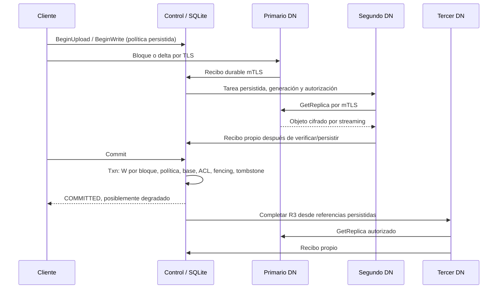

# Etapa 6: replicación y recuperación

Estado: **E6 implementada y verificada en Windows local**, 2026-09-12.
El alcance comprobado es R3/W2 ante fallos de procesos en un host; no HA del control.
El PDF original de siete páginas fue leído íntegramente; RNF2/RNF3/RNF4 motivan
replicación y consistencia. Los parámetros y algoritmos siguientes son decisiones
del equipo derivadas del prompt E6, no requisitos adicionales del docente.

## Decisiones D45–D50

- D45: perfil `replication_enabled=true`, R=3 objetivo y W=2 por versión nueva.
  Política y revisión persistidas por archivo y copiadas a la intención de cada
  operación. H1/H2/E5 mantienen R=1/W=1 y raíces separadas. El control sigue único,
  SQLite/CQRS sin etcd. R no es quórum de lectura: basta una copia íntegra exacta.
- D46: laboratorio `process-simulation`: dominios lógicos ligados a identidades
  autorizadas administrativamente, almacenamiento separado. No acredita hosts
  independientes. Perfil `independent-hosts` requiere inventario administrativo
  de infraestructura; las etiquetas por sí solas no prueban independencia.
- D47: primario recibe contenido/delta; destinos copian ciphertext por S/S con
  claves autorizadas. Cada destino confirma su objeto. La transacción de commit
  comprueba W por bloque nuevo, política/revisión, ACL, base, tombstone y fencing.
  El SDK puede esperar durabilidad con plazo acotado; no se mantiene una transacción
  durante copia ni se reduce W. Dos destinos bastan; el tercero queda pendiente.
- D48: reconciliación persistente de referencias y copias; tareas con identidad,
  dueño, época/generación, vencimiento, intento y backoff. La necesidad de R se
  reconstruye desde manifiestos/pins/operaciones persistentes. Una tarea no crea
  una referencia lógica ni perpetúa por sí sola un bloque sin consumidores.
- D49: salud de cada copia separada de durabilidad histórica. Comprobación de
  integridad autenticada y retorno reconciliado; corrupción excluye esa copia.
  Reparación en el mismo nodo compara la instancia física previa y la pone en
  cuarentena; eliminación tardía compara instancia/tarea. RETIRED es irreversible.
- D50: promoción administrativa R1→R3 con barrera persistida de mutaciones,
  duración acotada, cancelación de preparaciones antiguas y revisión incrementada.
  Copia manifiesto actual y snapshots retenidos sin cambiar versiones ni contenido;
  se informa progreso real y solo termina protegida después de verificar copias.

## Contrato implementado y límites de mantenimiento

`GetProtection` consulta hasta 64 bloques por página y distingue política,
confirmaciones históricas y copias actualmente elegibles. El resumen NORMAL /
DEGRADED / UNAVAILABLE corresponde a esa página; hay que recorrer next_cursor
para resumir un archivo entero. La consulta de una operación pertenece a su
usuario; la de un archivo exige lectura. La política del archivo prevalece sobre
el perfil predeterminado y el cliente. Un almacén con archivos protegidos rechaza
arrancar con el perfil R1 (`PROTECTED_STORE_REQUIRES_REPLICATION_PROFILE`).

La política se conserva como registros aditivos en la tabla genérica existente;
no hay cambio destructivo de DDL ni migración de bloques. Un archivo R1 permanece
R1 hasta `promote`. La promoción incrementa revisión, cancela preparaciones
anteriores y bloquea nuevas mutaciones durante hasta cinco minutos. Al completar
R3 para versiones útiles termina ACTIVE. Si vence, informa PROMOTION_BLOCKED y
libera la barrera, conservando R3/W2 para futuras mutaciones; no declara protección
completa por haber cambiado la política. Se puede reintentar administrativamente.

Planificación: bandas de ocupación del 5%, carga activa y round robin para
primarios; copias en dominios autorizados distintos, por ocupación/carga/identidad.
Reservas de destinos provisionales pasan a tareas sin sumarse dos veces. Dos
destinos bastan para preparar; reservar tres no es requisito oculto de commit.
El SDK espera W con consultas de cinco segundos y presupuesto total inicial de
240 s, renovando upload/locks/handle mediante los mecanismos E5. El commit vuelve
a comprobar W, revisión y fencing dentro de SQLite aunque el cliente omita esperar.

Mantenimiento: una copia S/S simultánea por clúster, hasta una retirada adicional
por iteración; admisión global DN 4/2/1 según perfil 4/64/128 MiB compartida con
clientes. Serializar copias evita ciclos de admisión entre origen y destino en
128 MiB; no serializa preparaciones cliente sobre bloques distintos. Tareas
persisten dueño/época, generación, intento, vencimiento de cinco minutos y próxima
ejecución. Backoff de despacho hasta 10 s y replanificación hasta 30 s. Una caída
o nueva generación cancela el plan obsoleto; la necesidad se reconstruye desde
referencias autoritativas, sin cambiar versiones ni bajar R. No hay reequilibrado
ni eliminación automática de una cuarta copia válida.

Scrub comprueba como máximo una copia por pasada, con intervalo por copia de
30 s y RPC interna de 5 s. Es un recorrido acotado, no promesa de detectar toda
corrupción en 30 s para cualquier cantidad de bloques. Timeout no equivale a
pérdida. DATA_LOSS / NOT_FOUND verificados excluyen la copia; otras copias siguen
sirviendo. El SDK recuerda destinos fallidos y reanuda rangos sin repetir prefijos.
receive conserva su temporal y vuelve al comienzo del bloque fallido.

La reparación copia ciphertext sin recifrar; destino comprueba hash, identidad y
AES-GCM con su clave antes de emitir recibo. Cuarentena conserva la instancia
defectuosa con su recibo; su espacio sigue contando en la cuota. El borrado físico
compara `expected_receipt_id` bajo pin exclusivo y revalida autorización. Las
versiones globalmente RETIRED no se vuelven a admitir. Las tareas canceladas no
mantienen referencias por sí mismas; provisionales completos con recibo se
limpian mediante decisión del control. Un objeto de resultado incierto tras caída
se reconcilia al reiniciar, priorizando retenerlo sobre un borrado inseguro.

Durabilidad local: objeto temporal cifrado, flush/fsync, instalación en el mismo
filesystem e inventario SQLite WAL/FULL antes del ACK. Python documenta que
[fsync](https://docs.python.org/3.12/library/os.html#os.fsync) utiliza `_commit`
en Windows; [SQLite FULL](https://www.sqlite.org/pragma.html#pragma_synchronous)
mantiene su sincronización de transacciones. Se prueban caídas de procesos; no
se ensaya corte eléctrico ni se acredita fsync de directorios en Windows.
Los [campos Protobuf son aditivos](https://protobuf.dev/programming-guides/proto3/#updating).
Dependencias y runtime permanecen fijados.

SQLite, WAL e inventarios conservan la protección por ACL del host, sin cifrado
de volumen acreditado. Bloques y staging usan AES-GCM; claves fuera del almacén
y de Git. Backups coordinados y custodia externa siguen pendientes E8. Las
réplicas no sustituyen backups ni toleran por sí solas perder el control único.

## Reproducción en PowerShell

Desde F:\DFSha con el Python existente:

```powershell
.\.venv-win\Scripts\python.exe scripts/verify_stage6.py --measure
.\.venv-win\Scripts\python.exe scripts/lab_hito2.py init --replication --root .runtime/demo-e6 --block-size 67108864
.\.venv-win\Scripts\python.exe scripts/lab_hito2.py start --root .runtime/demo-e6
.\.venv-win\Scripts\python.exe -m dfsha.client.cli --config .runtime/demo-e6/client.toml --session-file .runtime/demo-e6/session.json login admin
.\.venv-win\Scripts\python.exe -m dfsha.client.cli --config .runtime/demo-e6/client.toml --session-file .runtime/demo-e6/session.json shell
```

Contraseña exclusiva del laboratorio: development-password, introducida por
terminal. En shell: `put README.md /demo`, `protection /demo`, `get /demo
.runtime/demo-e6/download.md`. `protection` informa dominios y recibos; no cambia
estado. `promote /archivo-r1 <revision>` inicia promoción administrativa.

```powershell
New-Item -ItemType File .runtime/demo-e6/datanode-1/stop
.\.venv-win\Scripts\python.exe scripts/lab_hito2.py status --root .runtime/demo-e6
.\.venv-win\Scripts\python.exe scripts/lab_hito2.py add-fourth --root .runtime/demo-e6
.\.venv-win\Scripts\python.exe scripts/lab_hito2.py status --root .runtime/demo-e6
.\.venv-win\Scripts\python.exe scripts/lab_hito2.py stop --root .runtime/demo-e6
```

Esperar UNAVAILABLE/READY observando `status`, y NORMAL con `protection`; no
continuar por una espera fija. `measure_stage6.py` automatiza esas condiciones y
produce tiempos desde stop, apertura alternativa e inicio del cuarto nodo.
El cuarto nodo está preautorizado administrativamente; el cliente no se edita.
H1/H2/E5 se conservan con sus verificadores y sin `--replication`.

## Verificación y evidencias

Regresión E5 de partida: 114 aprobadas en 594,65 s y medición aprobada,
[resultado](evidencias/etapa5/20260911T103142Z/result.json).
Regresión conjunta E6: **130 aprobadas, cero fallos/errores/omisiones**, 1413,54 s,
[resultado](evidencias/etapa6/20260911T202330Z/result.json). Después se amplió GC:
comprobación por red de conservación con lector y eliminación física al cerrar,
aprobada en 39,10 s. Una prueba aislada adicional del recibo de instancia física
aprobó en 0,21 s: 131 casos distintos entre ambas ejecuciones, sin sumar repeticiones.
La autorización sustituida de esa última prueba no acredita comunicaciones;
las copias, corrupción/reparación y callbacks obsoletos sí tienen pruebas reales.

Archivo de 512 MiB, ocho bloques de 64 MiB, R3 verificado y SHA-256 correcto;
parche de 4096 bytes, caída de un nodo, lectura alternativa y cuarto nodo que
restaura tres copias activas. [Tablas de copias, tráfico y memoria](evidencias/etapa6/medicion.md)
y [JSON completo](evidencias/etapa6/measurement-final.json).
Subida 57,844 s, descarga 14,969 s, commit del parche 8,828 s. Detección desde
stop 6,047 s, lectura alternativa desde open 0,828 s y reparación desde inicio
del cuarto nodo 37,187 s. Máximos residentes: cliente 63,02 MiB, control 63,11 MiB,
DN máximo 56,23 MiB. Son medidas de esa ejecución con una sesión SDK, no garantías
para todos los perfiles ni métricas históricas de E5.
El control transporta cero contenido de archivo; W se comprueba por bloque.
Concurrencia: dos clientes preparan bloques diferentes con barrera antes de
publicar, y se conservan ambos cambios. Un escritor vencido con dos copias
preparadas no puede publicar después de su sucesor.

58 RPC compilables, 34 módulos generados importados; perfil E6 con 56 métodos
implementados y dos futuros (RefreshSession y StoreReplica). La réplica usa
GetReplica por pull S/S; no exige implementar también el contrato push futuro.
[Wheel probado desde site-packages](evidencias/etapa6/installed-smoke.json),
con parche entre bloques y snapshot anterior válido. Sin cambio de dependencias.

El [inventario de evidencias](evidencias/etapa6/README.md) conserva fallos y
correcciones: expectativa de retorno inmediato, SyntaxError del primer smoke,
memoria inicial del lanzador venv y contadores mutables. Solo la medición final
se utiliza para informar máximos de todos los procesos participantes.



COM-01/02/04/05 se extienden; COM-03 y etcd permanecen en E7.

## Límites y siguiente etapa

Linux BLOQUEADO POR ENTORNO: WSL ausente. HA del control E7, seguridad integral
E8 e Internet/cloud siguen pendientes. Q01–Q07 sin respuestas nuevas.
La medición de memoria E6 usa una sesión SDK; la concurrencia funcional usa dos
clientes. Carga sostenida de muchos clientes, cortes eléctricos y fallos de host
no se ensayaron; 128 MiB tiene validación funcional, no optimización demostrada.
Manifiestos/planes/inventarios salen paginados por RPC, pero la implementación
SQLite genérica todavía recorre colecciones de metadatos en mantenimiento;
es un límite de escala a medir en E10, no contenido de archivos cargado en control.
La cuarentena no se purga automáticamente y consume cuota.

E7 deberá llevar autoridad de metadatos, locks y mantenimiento a coordinación
compartida, invalidar ejecutores antiguos y comprobar quórum/failover con tres
controles. No se ha ejecutado E7 ni sustituido SQLite en esta entrega.
